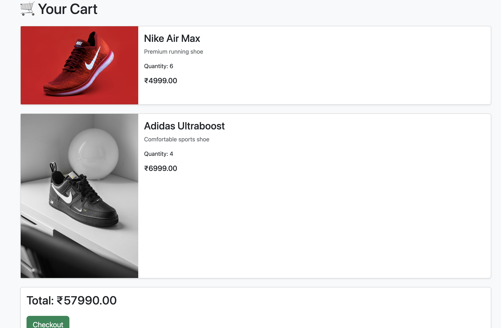

# 🛍 Smart Store

A full-stack e-commerce web application built using **Django**, **Bootstrap**, and **SQLite**.

Smart Store allows users to browse products, register accounts, add products to a shopping cart, place orders, and view order history through a clean and responsive interface.

---

## 🚀 Live Demo

🌐 Live Website:

https://smart-store-pra9.onrender.com

📂 GitHub Repository:

https://github.com/adepat06/smart-store

---

## 📸 Screenshots

### Homepage


---

### Product Catalog


---

### Product Details


---

### Shopping Cart



---

### Order Success


---

### Order History


---

### User Registration


---

### User Login


---

## ✨ Features

### 👤 User Authentication

- User Registration
- User Login
- User Logout
- Secure Password Storage

### 🛒 Shopping Experience

- Product Listing Page
- Product Detail Page
- Product Images
- Product Descriptions
- Quantity Selection

### 🛍 Cart System

- Add Products To Cart
- Update Quantity
- Cart Total Calculation
- User-Specific Cart

### 📦 Order Management

- Checkout Process
- Order Success Page
- Order History
- Multiple Products Per Order

### 🎨 User Interface

- Responsive Design
- Bootstrap 5 Styling
- Mobile-Friendly Layout
- Navigation Bar
- Product Cards

---

## 🛠 Tech Stack

### Backend

- Python 3
- Django 4

### Frontend

- HTML5
- CSS3
- Bootstrap 5

### Database

- SQLite

### Deployment

- Render

### Version Control

- Git
- GitHub

---

## 📂 Project Structure

```text
smart_store/
│
├── accounts/
│   ├── models.py
│   ├── views.py
│   └── urls.py
│
├── products/
│   ├── models.py
│   ├── views.py
│   └── urls.py
│
├── cart/
│   ├── models.py
│   ├── views.py
│   └── urls.py
│
├── orders/
│   ├── models.py
│   ├── views.py
│   └── urls.py
│
├── templates/
│
├── config/
│
├── manage.py
│
└── requirements.txt
```

---

## ⚙️ Installation

### 1. Clone Repository

```bash
git clone https://github.com/adepat06/smart-store.git
```

### 2. Navigate To Project

```bash
cd smart-store
```

### 3. Create Virtual Environment

```bash
python -m venv venv
```

### 4. Activate Virtual Environment

#### Mac/Linux

```bash
source venv/bin/activate
```

#### Windows

```bash
venv\Scripts\activate
```

### 5. Install Dependencies

```bash
pip install -r requirements.txt
```

### 6. Apply Migrations

```bash
python manage.py migrate
```

### 7. Run Server

```bash
python manage.py runserver
```

### 8. Open Browser

```text
http://127.0.0.1:8000/
```

---

## 🧠 What I Learned

During this project I learned:

- Django Project Structure
- Django Models
- Django Authentication
- URL Routing
- Template Rendering
- CRUD Operations
- Cart Logic
- Order Processing
- Database Relationships
- Git & GitHub Workflow
- Deployment using Render
- Debugging Real Production Issues

---

## 🔮 Future Improvements

Planned upgrades:

- Product Search
- Product Categories
- Product Filters
- Wishlist
- User Profiles
- Razorpay Payment Integration
- Admin Dashboard Analytics
- Product Reviews & Ratings
- Email Notifications
- Inventory Management

---

## 🎯 Key Concepts Implemented

- Django ORM
- Foreign Keys
- User Authentication
- Session Management
- Dynamic Templates
- Form Handling
- Responsive Design
- Database Migrations
- Production Deployment

---

## 🌟 Project Status

✅ Completed

Current Version:

```text
Version 1.0
```

Features implemented:

```text
✔ Registration
✔ Login
✔ Logout
✔ Product Catalog
✔ Product Detail Page
✔ Shopping Cart
✔ Quantity Selection
✔ Checkout
✔ Order Success Page
✔ Order History
✔ Deployment
```

---

## 👩‍💻 Author

### Adelin Patricia

GitHub:

https://github.com/adepat06

---

## ⭐ Support

If you found this project useful, consider giving it a ⭐ on GitHub.

It helps others discover the project and supports future development.

---

## 📜 License

This project is created for educational and portfolio purposes.