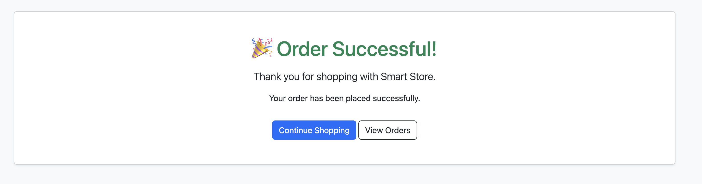
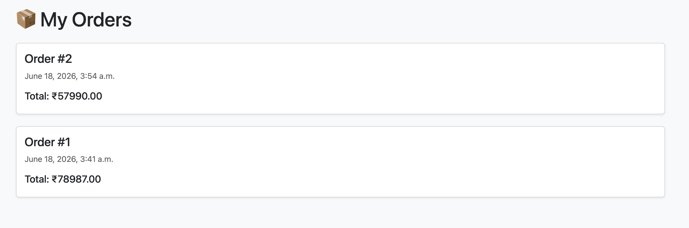

# 🛍 Smart Store

A full-stack e-commerce web application built using **Django**, **Bootstrap**, and **SQLite**.

Smart Store allows users to browse products, register accounts, add products to a shopping cart, place orders, and view order history through a clean and responsive interface.

---

## 🚀 Live Demo

🌐 Live Website:

https://smart-store-pra9.onrender.com

📂 GitHub Repository:

https://github.com/adepat06/smart-store

---

## 📸 Screenshots

### Homepage


---

### Product Catalog


---

### Product Details


---

### Shopping Cart


---

### Order Success



---

### Order History



---

## ✨ Features

### 👤 User Authentication

* User Registration
* User Login
* User Logout
* Secure Password Storage

### 🛒 Shopping Experience

* Product Listing Page
* Product Detail Page
* Product Images
* Product Descriptions
* Quantity Selection

### 🛍 Cart System

* Add Products To Cart
* User-Specific Cart
* Quantity Management
* Cart Total Calculation

### 📦 Order Management

* Checkout Process
* Order Success Page
* Order History
* Multiple Products Per Order

### 🎨 User Interface

* Responsive Design
* Bootstrap 5 Styling
* Mobile-Friendly Layout
* Navigation Bar
* Product Cards

---

## 🛠 Tech Stack

### Backend

* Python 3
* Django 4

### Frontend

* HTML5
* CSS3
* Bootstrap 5

### Database

* SQLite

### Deployment

* Render

### Version Control

* Git
* GitHub

---

## 📂 Project Structure

```text
smart_store/
│
├── accounts/
├── products/
├── cart/
├── orders/
├── templates/
├── screenshots/
├── config/
├── manage.py
└── requirements.txt
```

---

## ⚙️ Installation

### 1. Clone Repository

```bash
git clone https://github.com/adepat06/smart-store.git
```

### 2. Navigate To Project

```bash
cd smart-store
```

### 3. Create Virtual Environment

```bash
python -m venv venv
```

### 4. Activate Virtual Environment

Mac/Linux:

```bash
source venv/bin/activate
```

Windows:

```bash
venv\Scripts\activate
```

### 5. Install Dependencies

```bash
pip install -r requirements.txt
```

### 6. Apply Migrations

```bash
python manage.py migrate
```

### 7. Run Development Server

```bash
python manage.py runserver
```

### 8. Open Browser

```text
http://127.0.0.1:8000/
```

---

## 🧠 What I Learned

* Django Project Structure
* Django Models
* Django Authentication
* URL Routing
* Template Rendering
* Database Relationships
* Cart Functionality
* Order Processing Workflow
* Git & GitHub Workflow
* Deployment Using Render
* Debugging Production Issues
* Responsive UI Design

---

## 🎯 Key Concepts Implemented

* Django ORM
* Foreign Keys
* User Authentication
* Session Management
* Dynamic Templates
* Form Handling
* Responsive Design
* Database Migrations
* Production Deployment

---

## 🔮 Future Improvements

* Product Search
* Product Categories
* Product Filters
* Wishlist Functionality
* User Profiles
* Razorpay Payment Integration
* Product Reviews & Ratings
* Email Notifications
* Inventory Management
* Admin Dashboard Analytics

---

## 🌟 Project Status

### Version 1.0

✅ Completed and Deployed

Implemented Features:

* ✔ User Registration
* ✔ User Login
* ✔ User Logout
* ✔ Product Catalog
* ✔ Product Detail Page
* ✔ Shopping Cart
* ✔ Quantity Selection
* ✔ Checkout Process
* ✔ Order Success Page
* ✔ Order History
* ✔ Cloud Deployment

---

## 👩‍💻 Author

### Adelin Patricia A

GitHub:

https://github.com/adepat06

---

## ⭐ Support

If you found this project useful, consider giving it a ⭐ on GitHub.

It helps others discover the project and supports future development.

---

## 📜 License

This project was created for educational and portfolio purposes.
